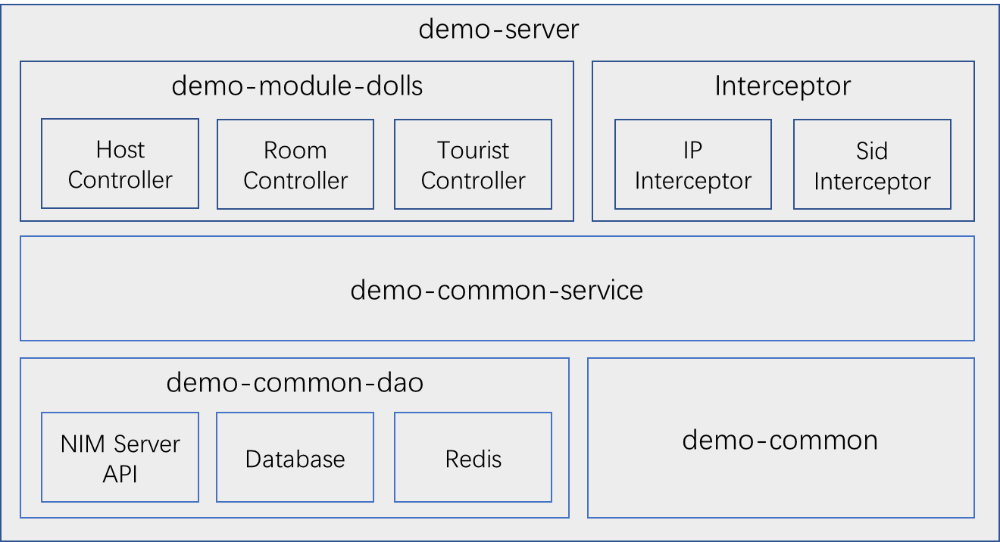

# 网易云信在线抓娃娃Demo Server实现说明
## 1 概述
### 1.1 服务器业务说明
抓娃娃demo应用服务器用于维护玩家账号和娃娃机房间信息。实际应用场景中，应用服务器还用于实现自定义业务逻辑，比如说娃娃机分类，玩家积分等。

业务主流程示意图如下所示：


业务场景如下：

1. 管理员初始化娃娃机房间  
	创建娃娃机房间的操作实际上包括三部分工作：
	+ 创建娃娃机侧绑定的云信id，玩家与娃娃机基于云信id进行交互。
	+ 创建娃娃机侧聊天室，用于实现玩家排队，聊天场景。
	+ 创建两个直播频道，用于娃娃机双摄像头两路直播。
	
	娃娃机房间创建完成后，拿到创建完成的娃娃机房间id，用于与娃娃机进行绑定。
1. 娃娃机绑定房间号  
	PC侧娃娃机启动时，需要绑定娃娃机房间号，该房间号由管理员提供。
1. 管理员设置房间可见  
	管理员确认娃娃机已绑定房间号并准备就绪后，设置房间对外可见，此时玩家可在娃娃机列表中看到该娃娃机，并且可以开始进行抓娃娃游戏。
1. 玩家获取帐号信息  
	为了简化业务场景，当前以游客账号的方式为玩家提供账号信息。实际应用中，为了便于账号权限控制，以及实现基于账号的业务逻辑，建议通过注册-登陆流程进行玩家账号信息发放。
1. 玩家查询娃娃机信息  
	玩家持有有效账号信息，可以查询娃娃机列表，并对可用娃娃机进行操作

### 1.2 权限控制说明
基于安全考虑，应该明确定义系统不同参与角色的操作边界，防止越权操作。目前游客账号的实现方式无法做到明确的权限控制，基于这点考虑，以IP白名单的形式作为权限补充：

+ 管理员权限：只允许管理员IP白名单组进行创建娃娃机房间，管理娃娃机房间等操作
+ 娃娃机权限：只允许娃娃机IP白名单组查询娃娃机侧房间信息（包含娃娃机云信id，直播推流地址等信息）

默认设置管理员IP白名单为`127.0.0.1`，即只允许应用服务器本身进行娃娃机管理操作，娃娃机权限开放，不进行限制。可以根据实际情况调整白名单配置。

另外，可以选择认证等更灵活的方式进行权限控制，或者基于认证+IP白名单的形式进行权限控制，这里不作扩展说明。

## 2 工程架构
### 2.1 技术框架
+ 项目依赖管理 Maven
+ Spring MVC 4.2.9.RELEASE
+ Spring Session 1.2.2.RELEASE
+ 数据库持久层框架 Mybatis 3.4.4
+ redis客户端 Redisson 1.2.1
+ Java Bean映射框架 Mapstruct 1.1.0.Final
+ Json处理框架 Fastjson 1.2.33
+ 日志框架 Slf4j 1.7.25 + Logback 1.2.3

### 2.2 逻辑架构


+ demo-server 模块，工程部署入口，包含IP拦截器、工程配置文件定义、全局异常处理等
+ demo-module-dolls 模块，对外接口定义，分为娃娃机主机相关、房间列表相关以及游客账号相关三部分
+ demo-common-service 模块，业务逻辑实现层
+ demo-common-dao 模块，数据依赖，包含云信Api调用，数据库和缓存调用
+ demo-common 模块，工程常量定义以及工具类实现

## 3 部署说明
### 3.1 前置条件
#### 3.1.1 Mysql数据库配置  
数据库配置完成后，需要确定如下配置：

+ 数据库地址：假设为`127.0.0.1:3306`
+ 数据库名称：默认设置为`appdemo`
+ 数据用户名：默认设置为`demouser`
+ 数据库密码：默认设置为`demopass`
+ 创建数据表：`demo_seq`、`demo_dolls_tourist`、`demo_dolls_live`、`demo_dolls_room`
	
具体操作如下：
	
+ 确保已安装Mysql数据库（推荐版本5.5+）  
+ 创建数据库以及数据库用户（如果已有配置，可跳过，直接进行下一步）  
	
	``` 
	# 创建数据库，数据库名称可自定义
	CREATE DATABASE `appdemo` DEFAULT CHARACTER SET utf8 COLLATE utf8_general_ci;
	
	# 创建数据库用户
	CREATE USER 'demouser'@'%' IDENTIFIED BY 'demopass';
	
	# 赋予用户数据库操作权限
	GRANT ALL ON appdemo.* TO 'demouser'@'%';
	```
	**注意：为了简化和统一配置，数据库用户host设置为'%'，并且赋予了appdemo库的所有权限，安全级别较低，生产环境请自定义配置**
+ 创建数据表
	
	```
	# 建表语句
	use appdemo;
	
	# 全局递增序列号表，当前用于生成唯一游客id
	CREATE TABLE `demo_seq` (
	  `id` bigint(11) unsigned NOT NULL AUTO_INCREMENT,
	  PRIMARY KEY (`id`)
	) ENGINE=InnoDB AUTO_INCREMENT=10000 DEFAULT CHARSET=utf8 COMMENT='全局递增序列号表';
	
	# 游客账号表
	CREATE TABLE `demo_dolls_tourist` (
	  `id` bigint(20) NOT NULL AUTO_INCREMENT COMMENT '主键ID',
	  `accid` varchar(64) NOT NULL COMMENT '游客账号',
	  `nickname` varchar(64) NOT NULL COMMENT '游客昵称',
	  `im_token` varchar(64) DEFAULT NULL COMMENT 'im token',
	  `available_at` bigint(20) NOT NULL DEFAULT '0' COMMENT '游客账号被释放的毫秒时间戳',
	  `created_at` timestamp NOT NULL DEFAULT '2017-01-01 00:00:00' COMMENT '创建时间',
	  `updated_at` timestamp NOT NULL DEFAULT CURRENT_TIMESTAMP ON UPDATE CURRENT_TIMESTAMP COMMENT '更新时间',
	  PRIMARY KEY (`id`),
	  UNIQUE KEY `idx_accid` (`accid`),
	  KEY `idx_available_at` (`available_at`)
	) ENGINE=InnoDB AUTO_INCREMENT=1 DEFAULT CHARSET=utf8 COMMENT='娃娃机游客账号表';

	# 直播频道信息表
	CREATE TABLE `demo_dolls_live` (
	  `id` bigint(20) NOT NULL AUTO_INCREMENT,
	  `cid` varchar(64) NOT NULL COMMENT '频道ID，32位字符串',
	  `name` varchar(128) NOT NULL COMMENT '频道名称，64位字符',
	  `type` tinyint(4) NOT NULL DEFAULT '0' COMMENT '频道类型，0-rtmp, 1-hls, 2-http',
	  `push_url` varchar(255) DEFAULT NULL COMMENT '推流地址',
	  `http_pull_url` varchar(255) DEFAULT NULL COMMENT 'http拉流地址',
	  `hls_pull_url` varchar(255) DEFAULT NULL COMMENT 'hls拉流地址',
	  `rtmp_pull_url` varchar(255) DEFAULT NULL COMMENT 'rtmp拉流地址',
	  `created_at` timestamp NOT NULL DEFAULT '2017-01-01 00:00:00' COMMENT '创建时间',
	  `updated_at` timestamp NOT NULL DEFAULT CURRENT_TIMESTAMP ON UPDATE CURRENT_TIMESTAMP COMMENT '更新时间',
	  PRIMARY KEY (`id`),
	  UNIQUE KEY `unique_cid` (`cid`)
	) ENGINE=InnoDB AUTO_INCREMENT=1 DEFAULT CHARSET=utf8 COMMENT='娃娃机直播信息表';
	
	# 娃娃机房间信息表
	CREATE TABLE `demo_dolls_room` (
	  `id` bigint(20) NOT NULL AUTO_INCREMENT COMMENT '主键ID',
	  `room_id` bigint(20) NOT NULL COMMENT '聊天室房间号',
	  `creator` varchar(64) NOT NULL COMMENT '房主账号',
	  `creator_token` varchar(64) NOT NULL DEFAULT '' COMMENT '房主IM token',
	  `name` varchar(128) NOT NULL COMMENT '房间名称',
	  `is_public` bit(1) NOT NULL DEFAULT b'0' COMMENT '是否为公共聊天室，0-不是；1-是',
	  `live_config` varchar(4096) DEFAULT NULL COMMENT '直播配置信息',
	  `created_at` timestamp NOT NULL DEFAULT '2017-01-01 00:00:00' COMMENT '创建时间',
	  `updated_at` timestamp NOT NULL DEFAULT CURRENT_TIMESTAMP ON UPDATE CURRENT_TIMESTAMP COMMENT '更新时间',
	  PRIMARY KEY (`id`),
	  KEY `idx_roomid` (`room_id`),
	  KEY `idx_creator` (`creator`)
	) ENGINE=InnoDB AUTO_INCREMENT=1 DEFAULT CHARSET=utf8 COMMENT='娃娃机房间信息表';
	```
	
#### 3.1.2 Redis配置  
确定redis配置信息：

+ redis地址：假设为`127.0.0.1:6379`
+ redis密码：假设未设置密码

#### 3.1.3 云信App配置  
从[云信控制台](https://app.netease.im/index#/)获取应用信息，假设为：

+ `App Key: bc01d41ebc78d6v5kn23a83d33f08n9c`
+ `App Secret: cl2k6c7p3xh0`
	
确保应用开通以下功能：  
	
+ 实时音视频
+ 直播
+ 聊天室

#### 3.1.4 Maven配置
确保服务器已安装 Maven  
执行 `mvn -v`命令能看到 maven相关信息输出

```
$ mvn -v
Apache Maven...
Maven home...
```

### 3.2 工程配置
配置文件根据环境不同，位于不同的路径下，部署时通过指定 Maven Profile 属性，使用指定环境的配置文件。目前已有配置文件的路径如下，其中`dev`表示开发环境，`test`表示测试环境，`pre`表示预发步环境，`prod`表示线上生产环境。相关的Maven配置位于工程目录`demo-server/pom.xml`文件的`profiles`节点中，默认启用开发环境`dev`。

```
demo-server/src/main/resources/profile
├── dev
│   ├── config.properties
│   ├── db.properties
│   └── logback.xml
├── pre
│   ├── config.properties
│   ├── db.properties
│   └── logback.xml
├── prod
│   ├── config.properties
│   ├── db.properties
│   └── logback.xml
└── test
    ├── config.properties
    ├── db.properties
    └── logback.xml
```

+ `config.properties`文件配置
	- 云信服务端api接口地址配置：`nim.server.api.url=https://api.netease.im/nimserver/`
	- 视频云直播api接口地址配置：`vcloud.server.api.url=https://vcloud.163.com/`
	- AppKey配置：`appkey=bc01d41ebc78d6v5kn23a83d33f08n9c`
	- AppSecret配置：`cl2k6c7p3xh0`
+ `db.properties`文件配置
	- Mysql配置  
	
		```
		mysql.driver=com.mysql.jdbc.Driver
		mysql.url=jdbc:mysql://127.0.0.1:3306/appdemo?useUnicode=true&characterEncoding=utf-8&allowMultiQueries=true
		mysql.user=demouser
		mysql.pwd=demopass
		```
	- Redis配置
	
		```
		redis.ip=127.0.0.1
		redis.port=6379
		redis.password=
		```
+ `logback.xml`文件配置
	- 指定工程日志路径  
		默认配置为：`<property name="log.dir" scope="context" value="${catalina.home}/logs"/>`
		可以根据需要自定义工程日志路径
		
+ IP白名单配置  
	以娃娃机管理员IP白名单配置为例，在`applicationContext-ip.xml`文件中编辑IP白名单列表，默认只包含`127.0.0.1`。IP白名单配置支持通配符，支持范围匹配。
	
	```
	<!-- demo-server/src/main/resources/mvc-dispatcher-servlet.xml -->
	<mvc:interceptor>
        <mvc:mapping path="/dollsCatcher/host/create"/>
        <mvc:mapping path="/dollsCatcher/host/manage"/>
        <ref bean="internalIpInterceptor"/>
   </mvc:interceptor>
   
   <!-- demo-server/src/main/resources/applicationContext-ip.xml -->
   <!-- 内部ip白名单配置，指定能够访问房间管理接口的ip列表 -->
   <bean id="internalIpInterceptor" class="com.netease.mmc.demo.web.interceptor.IpSecurityInterceptor">
		<property name="ipFilter" value="true"/>
		<property name="allowIpList">
			<list>
				<value>127.0.0.1</value>
				<!--<value>192.168.1.*</value>-->
				<!--<value>192.168.1.*-192.168.2.*</value>-->
			</list>
		</property>
	</bean>
	```

### 3.3 项目部署

+ 通过war包部署  
	切换到工程根目录下，执行以下操作：
	
	```
	# 从父工程打包，使用开发环境配置文件，跳过单元测试
	$ mvn clean install -Pdev -Dmaven.test.skip=true
	```
	打包成功后，会生成war包 `demo-server/target/appdemo.war`  
	接下来就可以将war包发布到已有tomcat的`webapps`目录下进行部署
+ 直接通过`maven tomcat`插件部署  
	项目父工程`pom.xml`文件中已经定义好了插件配置，默认部署到tomcat根目录下，并指定端口`8081`。
	
	```
    <plugin>
        <groupId>org.apache.tomcat.maven</groupId>
        <artifactId>tomcat7-maven-plugin</artifactId>
        <version>2.1</version>
        <configuration>
            <path>/</path>
            <port>8081</port>
            <charset>UTF-8</charset>
            <uriEncoding>UTF8</uriEncoding>
        </configuration>
    </plugin>
	```
	切换到工程根目录下，执行以下操作：
	
	```
	# 从父工程打包，使用开发环境配置文件，跳过单元测试
	$ mvn clean install -Pdev -Dmaven.test.skip=true
	
	# 切换到 demo-server 模块
	$ cd demo-server
	
	# 通过tomcat插件启动
	$ mvn tomcat7:run
	```

## 4 接口描述
### 4.1 接口概述
根据系统角色不同，将接口分为三类：

+ 娃娃机管理接口：由管理员调用，用于初始化娃娃机房间信息，以及控制娃娃机房间状态。
+ 娃娃机调用接口：由娃娃机调用，用于查询娃娃机侧房间信息。
+ 玩家调用接口：由玩家调用，用于获取账号信息，玩家侧娃娃机房间信息。


#### 4.1.1 接口地址说明
根据部署方式以及部署服务器的不同，娃娃机应用服务器的接口地址会有变更，因此后续接口描述中，以`${Host}`代替地址前缀，可以根据实际情况进行替换，例如：

+ 直接访问服务器  
	此时，假设服务器地址为`127.0.0.1`，tomcat部署端口为`8081`，工程映射到tomcat访问根目录，则 `${Host}=http://127.0.0.1:8081`
+ 通过nginx代理  
	假设nginx配置为：
	
	```
	server {
		listen		80;
		server_name	myserver.com
		
		location / {
			# 转发到实际部署地址
			proxy_pass http://127.0.0.1:8081;
		}
	}
	```
	则`${Host}=http://myserver.com`

#### 4.1.2 接口返回值说明

所有接口返回类型为**JSON**。返回字段含义如下：

|名称	|类型	|说明    |
|:------|:-----:| :-----|
|code	|Int	|返回结果的状态码|
|msg	|String	|返回code非200时包含的错误信息|
|data	|String	|返回的结果集|
|data.list  |JsonArray | 用于返回列表结果|
|data.total| Int | 用于返回列表结果的总数|

### 4.2 娃娃机管理接口 
#### 4.2.1 初始化娃娃机房间信息
+ 接口说明  
	初始化娃娃机房间信息，创建与娃娃机绑定的云信id，创建聊天室房间，绑定直播推拉流信息。
	因为当前娃娃机使用两个摄像头进行推流，所以初始化娃娃机房间信息时，会绑定两个直播频道，娃娃机将根据获取到的两个推流地址进行推流。
+ 请求说明

	```
	POST http://${Host}/dollsCatcher/host/create HTTP/1.1
	Content-Type: application/x-www-form-urlencoded;charset=utf-8
	```
+ 参数说明

	|名称	|类型	|说明    |必须|
	|:------|:-----:| :-----|:---:|
	|accid|String| 需要注册的与娃娃机绑定的云信id|是|
	|nickname|String| 云信id的昵称|是|
	|password|String| 云信id token，不填将由云信服务器生成|否|
	|name|	String| 娃娃机房间名称|是|

+ 返回说明  
	http 响应：**JSON**
	
	|参数	|类型|	说明|
	|:------|:-----:| :-----|
	|data| int| 创建完成的娃娃机房间号，娃娃机可以根据房间号获取房间相关信息|
	
	```
	//成功结果示例
	"Content-Type": "application/json; charset=utf-8"
	{
	    "data": 12345678, // 创建完成的娃娃机房间号
	    "code": 200
	}
	
	//失败结果示例
	{
	    "code": 900,
	    "msg":"用户已注册"
	}
	```
+ 响应状态码  
	400、403、600、800、900  
	具体请参考 [错误码表](error_code.md)

#### 4.2.2 控制娃娃机房间状态
+ 接口说明  
	根据娃娃机房间号设置房间状态，以及房间是否在首页列表可见
+ 请求说明

	```
	POST http://${Host}/dollsCatcher/host/manage HTTP/1.1
	Content-Type: application/x-www-form-urlencoded;charset=utf-8
	```
+ 参数说明

	|名称	|类型	|说明    |必须|
	|:------|:-----:| :-----|:---:|
	|roomId|int| 目标娃娃机房间号|是|
	|roomStatus| Boolean| 目标房间状态；true-开启，false-关闭|否|
	|bePublic|String|首页列表可见；true-可见，false-隐藏|否|
	
	- `roomStatus`和`bePublic`参数至少要传一个，对应参数不传表示不对相关状态进行变更。
+ 返回说明  
	http 响应：**JSON**
	
	|参数	|类型|	说明|
	|:------|:-----:| :-----|
	|code| Int| 状态码|
	|msg| String| 错误信息|
	
	```
	//成功结果示例
	"Content-Type": "application/json; charset=utf-8"
	{
	    "code": 200
	}
	
	//失败结果示例
	{
	    "code": 403,
	    "msg":"没有权限"
	}
	```
+ 响应状态码  
	400、403、800   
	具体请参考 [错误码表](error_code.md)
	
### 4.3 娃娃机调用接口
#### 4.3.1 查询房间列表
+ 接口说明  
	获取当前房间列表，以及房间信息
+ 请求说明

	```
	POST http://${Host}/dollsCatcher/host/query HTTP/1.1
	Content-Type: application/x-www-form-urlencoded;charset=utf-8
	```
+ 参数说明

	|名称	|类型	|说明    |必须|
	|:------|:-----:| :-----|:---:|
	|roomId|int| 由管理员创建，与该娃娃机绑定的娃娃机房间id|是|
+ 返回说明  
	http 响应：**JSON**
	
	|参数	|类型|	说明|
	|:------|:-----:| :-----|	
	|roomId|String|娃娃机房间id|
	|name|String|娃娃机房间名称|
	|creator|String|娃娃机绑定的云信id|
	|creatorToken|String|云信id对应的云信token|
	|pushUrl1|String|推流地址1|
	|pushUrl2|String|推流地址2|
	|roomStatus|Boolean| 房间开关状态|
		
	```
	//成功结果示例
	"Content-Type": "application/json; charset=utf-8"
	{
	  "data": {
        "roomId": 12345678,
        "name": "云信在线娃娃机",
        "creator": "nimwwj",
        "creatorToken": "nimwwj",
        "pushUrl1": "rtmp://12345.live.126.net/live/...",
        "pushUrl2": "rtmp://12345.live.126.net/live/...",
        "roomStatus": true
	  },
	  "code": 200
	}
	//失败结果示例
	{
	    "code":804,
	    "msg":"房间不存在"
	}
	```
+ 响应状态码  
	400、800、804  
	具体请参考 [错误码表](error_code.md) 

### 4.4 玩家调用接口
#### 4.4.1 获取游客账户信息
+ 接口说明  
	无需注册和登陆，直接获取一个IM账号
+ 请求说明

	```
	POST http://${Host}/dollsCatcher/tourist HTTP/1.1
	Content-Type: application/x-www-form-urlencoded;charset=utf-8
	```
+ 参数说明

	|名称	|类型	|说明    |必须|
	|:------|:-----:| :-----|:---:|
	|sid|	String|	session id，保留当前游客身份，用于登录后的各类接口请求校验|否|

	- 在参数对应的sid未失效时，会返回sid对应的账号信息，并更新账号失效时间，其他情况（sid已失效或者sid不存在）会重新返回一个可用账号。

+ 返回说明  
	http 响应：**JSON**
	
	|参数	|类型|	说明|
	|:------|:-----:| :-----|
	|accid|String|用户账号|
	|nickname|String|用户昵称|
	|imToken|String|im token|
	
	```
	//成功结果示例
	"Content-Type": "application/json; charset=utf-8"
	{
	    "data":{
	        "accid":"test1",
	        "nickname": "玩家balabala",
	        "imToken":"444af5b2f64ea5cf57b61c512bfcc31",
	    },
	    "code":200
	}
	
	//失败结果示例
	{
	    "code":1101,
	    "msg":"当日获取游客次数已达上限"
	}
	```
+ 响应状态码  
	1100、1101、1102  
	具体请参考 [错误码表](error_code.md) 

#### 4.4.2 查询房间列表
+ 接口说明  
	获取当前房间列表，以及房间信息
+ 请求说明

	```
	POST http://${Host}/dollsCatcher/room/list HTTP/1.1
	Content-Type: application/x-www-form-urlencoded;charset=utf-8
	```
+ 参数说明

	|名称	|类型	|说明    |必须|
	|:------|:-----:| :-----|:---:|
	|sid|	String|	session id，即当前登陆用户的accid|是|
+ 返回说明  
	http 响应：**JSON**
	
	|参数	|类型|	说明|
	|:------|:-----:| :-----|
	|list|String|房间列表数据|
	|total|String|房间总数|
	|roomId|String|娃娃机房间id|
	|name|String|娃娃机房间名称|
	|creator|String|娃娃机对应账号accid|
	|rtmpPullUrl1|String|rtmp拉流地址1|
	|rtmpPullUrl2|String|rtmp拉流地址2|
	|httpPullUrl1|String|http拉流地址1|
	|httpPullUrl2|String|http拉流地址2|
	|hlsPullUrl1|String|hls拉流地址1|
	|hlsPullUrl2|String|hls拉流地址2|
	|roomStatus|Boolean| 房间开关状态|
	|liveStatus|Int|直播状态，0：空闲； 1：直播； |
	|onlineUserCount|Int|当前在线人数|
	
	```
	//成功结果示例
	"Content-Type": "application/json; charset=utf-8"
	{
	  "data": {
	    "total": 1,
	    "list": [
	      {
	        "roomId": 12345678,
	        "name": "云信在线娃娃机",
	        "creator": "nimwwj",
	        "rtmpPullUrl1": "rtmp://12345.live.126.net/live/...",
	        "rtmpPullUrl2": "rtmp://12345.live.126.net/live/...",
	        "httpPullUrl1": "http://12345.live.126.net/live/...",
	        "httpPullUrl2": "http://12345.live.126.net/live/...",
	        "hlsPullUrl1": "http://12345.live.126.net/live/...",
	        "hlsPullUrl2": "http://12345.live.126.net/live/...",
	        "roomStatus": true,
	        "liveStatus": 1,
	        "onlineUserCount": 20,
	        "queueCount": 8
	      }
	    ]
	  },
	  "code": 200
	}
	//失败结果示例
	{
	    "code":401,
	    "msg":"用户校验失败"
	}
	```
+ 响应状态码  
	400、401、600、800  
	具体请参考 [错误码表](error_code.md) 

