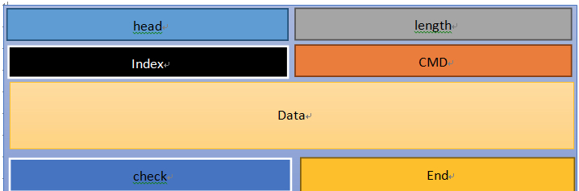

# 网易云信在线抓娃娃PC实现说明
## 一、pc推流端整体逻辑介绍
PC实现由 NIM sdk+直播推流SDK +UI界面组成（方便监控和查看调试）+ 串口控制模块 组成
### PC娃娃机准备（流程逻辑）
1、初始化sdk
2、获取娃娃机账号信息
具体包括 账号、登陆密码或token、游戏房间号、推流地址1用于正面摄像头、推流地址2用户侧面摄像头。实现包含2类：
        - 根据本地配置id号，向应用服务器获取账号信息
        - 直接本地配置全部账号信息
3、根据账号信息登陆 nim sdk
4、登陆完成后根据游戏房间号连接聊天室
娃娃机连接聊天室是为了使用聊天室的排队能力，用户有自己的排队机制，则娃娃机可以不连接聊天室。
5、在房间界面选择正确的正面摄像头和侧面摄像头，开始两路推流。摄像头第一次需要用户手动选择
6、初始化串口对象，用对应的主播配置设置娃娃机属性（串口对象需要一个串口设备名，可以通过PC的设备设置中看到，启动前将设备名填写到配置文件中方便窗口初始化。娃娃机部分属性在配置中可以修改）。
### 游戏过程
1、游戏开始：通过聊天室的排队信息变更事件，获取当前游戏成员
2、邀请游戏者进行对点对音视频通话，提供游戏者一个实时的画面，根据需要开启服务器录制。设置一个通话超时。
3、等游戏者接受通话邀请并加入到通话中，正式开始游戏。设置一个落抓超时，超时时间需要比娃娃机设置的落抓超时短，比游戏玩家客户端的超时时间长。
4、游戏过程中通过监听IM的点对点自定义系统消息，来进行指令操作。包括娃娃机移动操作及画面切换，画面复用直播画面。
5、游戏完成需要在落抓和结束通知时，设置一个短时间的超时，用于等待中奖信息。在最后通过点对点自定义系统消息通知玩家游戏结果。此时也可以同步把结果告知服务器用于数据记录和统计。
- 游戏清理，重置所有参数，结束音视频通话。
- 查询等待下一个游戏者，重新开始。
### 娃娃机PC界面介绍
1、登陆界面，包含账号密码输入及登陆按钮。如果配置正确在程序启动后会自动登陆。
2、房间进入界面，包含输入房间号和进入房间按钮。如果配置正确会在登陆后自动加入房间。
3、房间界面。
- 包含4个监控屏，
 - 左上为正面直播流原始画面
 - 右上为侧面直播流原始画面
 - 左下为游戏玩家将看到的原始画面
 - 右下为游戏玩家的画面，一般不需要的话玩家不发音视频
- 界面底部工具
 - 摄像头1为正面画面摄像头选择，第一次选择后将记录到本地
 - 摄像头2为侧面画面摄像头选择，第一次选择后将记录到本地
 - 预览按钮用户监控展示，默认不打开
 - 中断按钮将在当前游戏结束后不再发起新的游戏流程，关闭后自动发起新游戏。
- 右侧日志输出，简单的流程及部分娃娃机命令状态输出，用于可以根据代码自己增删改。

## 二、娃娃机场景重难点实现
### PC控制娃娃机（串口通信）的实现
Demo将娃娃机与PC之间的串口通讯协议封装成单独的一个类WwjControl，并将常用的操作封装成类对象方法。串口操作的接口都是通过回调函数异步将结果上报，整个操作流程是：打开串口->设置串口参数->设置娃娃机设备参数->其他参数设置->检测设备状态->上分->方向操作->操作结果上报。程序退出时关闭串口。设备异常通过设置的回调函数上报。
目前Demo 主板串口的数据帧格式图

格式说明如下
|名称|定义|长度|备注|
|--|--|--|--|
|head(帧头)|固定为0xAA|1 Bety||
|length(长度)|Index + CMD +Data + check 的长度|1 Bety||
|Index (索引)|主机：0x01 终端：0x01~0xFF|1 Bety|根据不同硬件设备固定为不同索引|
|CMD(命令)|表明数据帧的类型|1 Bety||
|Data\[N\](数据)|此帧数据区|N Bety（N<200B）|数据区长度可以为0|
|check(校验)|校验范围：Length+ Index+ CMD+ Data|1 Bety|校验算法为：异或值|
|End(帧尾)|固定为0xDD|1 Bety||

对象方法的简单说明

|对象方法|说明|
|--|--|
|SerialCmdHelp|完成对帧格式的组装|
|OpenSerial|打开串口|
|SetSerialParam|设置串口参数|
|CrownBlockReset|天车归位|
|GetSettingParam|获取娃娃机参数|
|Pay|云上分，上分之前应先调用CheckNormal接口检测设备状态 结果由回调返回|
|SerialDirectectOpt|娃娃机方向操作|
|QueryDeviceInfo|查询终端账目（用于查询设备的账目状况，故障状态等 结果由回调返回|
|CheckNormal|查询链接, 用户查询是否正常,结果由回调返回|
|SetOptFuncCb|设置回调函数|
    
### 观众观看场景（直播推流）的实现

直播推流通过直播推流sdk推rtmp流实现。由于sdk只支持单个推流，在加载sdk时，加载了2个sdk实例，分别用于推正面和侧面的画面。其中摄像头捕获用了nim sdk中的辅助摄像头功能，能同时开2个摄像头，在PC上层缓存2个摄像头的画面用于推流，同时方便游戏时选择其中一个画面发送给玩家。
直播推流地址在账号信息中，通过应用服务器查询或配置文件获取得到。
摄像头打开模式使用640\*480的画面，测试demo使用的是1：1的画面，直播推流为480\*480的画面。

### 游戏者场景视频（实时音视频）的实现

在娃娃机pc端需要先登录IM和聊天室，获得IM的收发能力用于指令操作，及点对点音视频呼叫能力用于给游戏者提供实时画面。
在游戏开始前，游戏者需要先到聊天室的排队队列中请求。PC娃娃机在队列变更时会获取第一个成员，并点对点音视频呼叫对方，对方接受进入音视频通话则游戏正式开始。
在游戏过程中，游戏者通过IM消息发送指令，控制娃娃机，并切换画面。音视频通话中PC娃娃机使用视频模式，打开自定义视频数据开关，根据游戏者需要使用正面或侧面的数据发送给对方。
最后接收到用户落抓或者超时或者音视频异常后，开始落抓操作。在落抓等待中奖结果后PC娃娃机主动结束，并将成员从队列中移除。
音视频流程中自定义的视频画面是和直播推流用同一组数据，两个摄像头画面两路直播各用一个，音视频通话则根据需要选择其中一个发送。为保证一致性，音视频通话也使用480\*480的画面，用户可以在发送前裁剪，也可以如demo中实现一样直接传640\*480的画面然后设置裁剪模式让sdk来裁剪。

### H5方案实现

H5方案和app（直播+实时音互动）方案的区别在于，H5方案始终以tcp推流发送娃娃机画面。H5和app方案相比，不用切换观看和游戏画面，在邀请玩家时不使用通话邀请，而通话自定义消息实现要求流程。

* 初始化及登陆
* 进入聊天室房间：得到排队能力
* 打开rts推流，用mjpeg1编码实现画面分享
* 监听排队，得到当前玩家信息
* 邀请玩家，等玩家同意开始游戏。邀请和同意都由自定义消息实现。
* 监听操作指令，和邀请等属于同一个消息类型
* 游戏结束返回游戏结果的自定义消息。
* 继续监听排队，循环

### 客户可通过配置文件配置的参数与配置方法

PC配置文件在运行目录同级中的server_conf.txt文件。使用xml格式设置参数属性。

其中除了appkey、comid及账号信息是必须配置，其他的可以选配。其中testurl是应用服务器的环境地址，用于实现demo向应用服务器获取账号信息。当设置了kQueryKey向应用服务器获取账号信息时，将自动使用服务器下发的信息。如果没有配置kQueryKey，将直接用配置的账号信息（备注中的第二套账号设置）。

当前配置的参数如下
####  环境配置
    
- kAppKey="用户使用的appkey"
- kTestUrl="应用服务器的环境"
- com_id="娃娃机接的串口号，需要的PC的设备列表中去查看"
- kLiveStream="直播推流功能开关，默认打开，填0关闭"
- kH5Stream="H5通道功能开关，默认打开，填0关闭"	
- kH5bitrate="H5通道码率相关"
- kH5gop="H5通道I帧间隔"
- kH5ft="H5通道发送帧间隔时间"
- kH5W="H5通道画面宽度"
- kH5H="H5通道画面高度"
    
#### 第一套账号配置，从应用服务器获取账号信息
    
kQueryKey="优先的第一套账号获取方式，通过kQueryKey去应用服务器获取登录id、密码token、房间号roomid、推流地址"
    
#### 第一套账号配置  
- kQueryKey="第二套账号设置"
- kPwd="第二套账号密码"
- kRoomId="第二套账号房间号"
- pushUrl1="第二套账号正面推流地址"
- pushUrl2="第二套账号侧面推流地址"
    
#### 游戏配置 
- kVideoRecord="是否服务器端录制玩家的画面"
- kGameStepSize="游戏控制的天车步进值，建议50-200，默认70"
- kGamePrizePattern="中奖模式(0 / 1 / 2  随机，固定，取消)"
- kGamePowerTime="强力时间，5-60"
- kGamePowerClaw="强爪抓力(5-50) 合爪上停强力"
- kGameTopPower="到顶抓力(0 - 40, 正常可以弱爪抓力相同)   (上停停顿抓力)"
- kGameWeakPower="弱爪抓力(0 - 40)      (天车回归弱力)"

## 三、PC推流端源码导读

### 工程概述
娃娃机Demo 是网易云通信的一款针对目前市场比较热门的娃娃机场景推出的解决方案。在方案中结合了网易云通信 IM 能力的聊天室模型和网易云通信的音视频能力的对对点音视频通话模型及直播推流模型。在使用本解决方案之前请务必了解  [IM即时通讯](http://dev.netease.im/docs/product/IM即时通讯/SDK开发集成/Windows开发集成/概要介绍) 的聊天室能力，和 [音视频通话](http://dev.netease.im/docs/product/音视频通话/SDK开发集成/Windows开发集成) 的对点对音视频能力，[直播推流](http://dev.netease.im/docs/product/直播/推流端SDK/Win推流SDK/开发指南.md)的直播推流能力。
Demo使用Visual Studio 2013 Update5开发(必须使用Update5版本)。

Demo源码中目录结构中的C++封装层文件夹名字尾部携带\_vs2010的为vs2010创建的工程项目，对应的不携带\_vs2010的为vs2013创建的工程项目，即Demo目前加载的工程，该工程依赖Demo工程。

Demo的主要功能由Demo工程本身以及`UI组件`工程共同完成，Demo工程和`UI组件`工程具有相同的目录结构。`UI组件`位于`tool_kits\ui_component\ui_kit`目录，`UI组件的`相关文档详见：[云信UI组件](https://github.com/netease-im/NIM_PC_UIKit)

### Demo源码版本历史
[Demo源码版本历史](http://dev.netease.im/docs/product/通用/Demo源码导读/PC通用/Demo%20版本历史)

### 界面开发资料 

#### 网易云信Duilib使用说明 

[代码托管地址](https://github.com/netease-im/NIM_PC_UIKit)

[网易云信Duilib使用说明](https://github.com/netease-im/NIM_PC_UIKit/blob/master/doc/nim_duilib.md)

### 控件属性 

[控件属性](https://github.com/netease-im/NIM_PC_UIKit/blob/master/doc/duilib%E5%B1%9E%E6%80%A7%E5%88%97%E8%A1%A8.xml)

#### 界面布局介绍 

[网易云信 DuiLib 布局功能指南](http://dev.netease.im/docs/product/通用/Demo源码导读/PC通用/Demo%20界面布局介绍)

### 会话多窗口实现介绍 

从3.0.0版本开始，Demo对会话窗口的实现进行了升级，方便开发者快速开发类似QQ，微信等多窗口模式。

[会话窗口多窗口合并及分开功能及升级说明](http://dev.netease.im/docs/product/通用/Demo源码导读/PC通用/Demo%20多会话窗口合并)

### CEF开发指南
从3.4.0版本开始，Demo增加了Cef控件，方便开发者开发Web相关的功能模块。
 
[CEF开发指南](http://dev.netease.im/docs/product/通用/Demo源码导读/PC通用/Demo%20CEF开发指南 "target=_blank")

### Duillib高分屏(高DPI)支持
从3.5.0版本开始，Duilib增加了对高分屏的支持，方便在用户设置了DPI后保持软件界面的清晰效果。
 
[Duillib高分屏(高DPI)支持](http://dev.netease.im/docs/product/通用/Demo源码导读/PC通用/Demo%20高分屏实现 "target=_blank")

### 目录结构

* callback：注册到SDK的一些回调的处理

* gui：所有功能的界面相关实现

* module：所有功能的逻辑相关实现

* util：一些公用的工具类

### 打包说明
开发者在打包自己的应用时，应确保将以下云信SDK相关文件打包进去。

- nim.dll：云信SDK主要功能库文件。

- nim_chatroom.dll:云信聊天室SDK主要功能库文件

- nim_audio.dll：语音消息功能库文件。

- nrtc.dll：音视频通话功能库文件。

- nrtc\_audio\_process.dll：音视处理功能库文件。

- nim\_tools\_http.dll：http功能库文件。

- nim\_audio\_hook.dll： 负责辅助采集播放器音频，由nrtc.dll调用；放在用户程序目录下，x64位暂时不提供该Dll。

- msvcr100.dll：SDK依赖的VS2010动态链接库。

- msvcp100.dll：SDK依赖的VS2010动态链接库。

- nim_conf：云信SDK配置文件目录，包含SDK版本控制等。

其他的文件及目录是应用程序相关的，开发者根据自己程序的使用情况选择是否打包。

- image_ole.dll：图像显示库文件，支持在RichEdit组件中插入和显示图片。

- translation.bin：中文翻译成拼音依赖的文件。

- app_ver.dll：云信Demo应用程序版本控制，开发者请勿打包到自己的应用。

- live_stream：直播推流Sdk库文件目录。

- lang：Demo界面文案对照表，可支持多国语言。

- res：Demo资源文件目录。

- themes：Demo皮肤目录，包含XML配置文件和图片文件。

### 功能点指引

#### SDK C++封装层

因为SDK所有接口都是C接口，为了方便使用C++的同学使用，我们提供了`nim_cpp_sdk`和`nim_chatroom_cpp_sdk`静态库。静态库位于`libs\nim_sdk_desktop\nim_cpp_sdk`和`libs\nim_sdk_desktop\nim_chatroom_cpp_sdk`目录，它将C接口SDK封装为C++代码，demo和`UI组件`都直接使用`nim_cpp_sdk`和`nim_chatroom_cpp_sdk`静态库的C++封装层代码。开发者可以直接在解决方案中导入`nim_cpp_sdk`工程和`nim_chatroom_cpp_sdk`工程。

封装层提供的包装文件如下：

* nim\_cpp\_sdk\\nim\_sdk\_cpp\\api\\nim\_cpp\_client.h: 全局管理功能；主要包括SDK初始化/清理、客户端登录/退出等功能

* nim\_cpp\_sdk\\nim\_sdk\_cpp\\api\\nim\_cpp\_data_sync.h: 数据同步相关接口

* nim\_cpp\_sdk\\nim\_sdk\_cpp\\api\\nim\_cpp\_friend.h: 好友功能，包含添加好友、删除好友、监听好友变化

* nim\_cpp\_sdk\\nim\_sdk\_cpp\\api\\nim\_cpp\_global.h: NIM SDK提供的一些全局接口；释放从SDK申请的内存

* nim\_cpp\_sdk\\nim\_sdk\_cpp\\api\\nim\_cpp\_msglog.h: 消息历史接口

* nim\_cpp\_sdk\\nim\_sdk\_cpp\\api\\nim\_cpp\_nos.h: NOS云存储服务接口；上传或下载文件资源

* nim\_cpp\_sdk\\nim\_sdk\_cpp\\api\\nim\_cpp\_rts.h: 白板功能

* nim\_cpp\_sdk\\nim\_sdk\_cpp\\api\\nim\_cpp\_session.h: 会话列表管理功能；主要包括查询会话列表、删除会话列表等功能

* nim\_cpp\_sdk\\nim\_sdk\_cpp\\api\\nim\_cpp\_sysmsg.h: 系统消息接口；主要包括查询系统消息、删除系统消息等功能

* nim\_cpp\_sdk\\nim\_sdk\_cpp\\api\\nim\_cpp\_talk.h: 聊天功能；主要包括发送消息、接收消息等功能

* nim\_cpp\_sdk\\nim\_sdk\_cpp\\api\\nim\_cpp\_team.h: 群组功能；主要包括查询群信息、查询群成员信息、加人、踢人等功能

* nim\_cpp\_sdk\\nim\_sdk\_cpp\\api\\nim\_cpp\_tool.h: 提供的一些工具接口，主要包括获取SDK里app account对应的app data目录，计算md5、语音转文字等

* nim\_cpp\_sdk\\nim\_sdk\_cpp\\api\\nim\_cpp\_vchat.h: 音视频（包括设备）相关接口

* nim\_cpp\_sdk\\nim\_sdk\_cpp\\api\\nim\_cpp\_user.h: 用户功能，包含黑名单设置、个人消息提醒设置、状态设置

* nim\_chatroom\_cpp\_sdk\\nim\_chatroom\_cpp\\api\\nim_chatroom_cpp.h :聊天室操作的相关接口

除了`nim_cpp_sdk`静态库，另外还提供了负责语音和http传输的dll的C++封装类：

* libs\\nim\_sdk\_desktop\\nim\_cpp\_sdk\\nim\_audio\_cpp\\nim\_tools\_audio\_cpp\_wrapper.h:提供的语音录制和播放接口
* libs\\nim\_sdk\_desktop\\nim\_cpp\_sdk\\nim\_http\_cpp\\nim\_tools\_http\_cpp\_wrapper.h:提供的http传输相关接口

#### SDK 初始化

SDK的初始化在main.cpp中InitNim方法进行。

示例：

	//sdk能力参数（必填）
	//string（db key必填，目前只支持最多32个字符的加密密钥！建议使用32个字符）
	config.database_encrypt_key_ = "Netease"; 

	std::string app_key = GetConfigValueAppKey();
	// 载入云信sdk，初始化安装目录和用户目录
	bool ret = nim::Client::Init(app_key, "NIM_LIVE", "", config); 
	assert(ret);
    //聊天室初始化
	ret = nim_chatroom::ChatRoom::Init("","");
	assert(ret);

	nim_ui::InitManager::GetInstance()->InitUiKit();
	nim_chatroom::ChatroomCallback::InitChatroomCallback();

#### 界面开发

云信PC demo以及UI组件的界面开发都依赖`云信DuiLib库`，关于`云信DuiLib库`的使用方法和注意事项，请参考：[云信Duilib](https://github.com/netease-im/NIM_PC_UIKit/blob/master/doc/nim_duilib.md)

### 登录

登录相关界面代码在`gui/login`目录下，登录相关的控制逻辑已经封装到了`UI组件的`，逻辑代码在`callback\login\login_callback.cpp`文件中。登录界面可以直接调用`UI组件`的登录函数，示例如下：

	std::string username = "123456789"；
	std::string password = "123456789"；
	nim_ui::LoginManager::GetInstance()->DoLogin(username, password);

### 总体流程

* 初始化sdk
* 获取娃娃机账号信息，包括 账号、登陆密码或token、游戏房间号、推流地址1用于正面摄像头、推流地址2用户侧面摄像头。实现包含2类：
    - 根据本地配置id号，向应用服务器获取账号信息
    - 直接本地配置全部账号信息
* 根据账号信息登陆 nim sdk
* 登陆完成后根据游戏房间号连接聊天室，娃娃机连接聊天室是为了使用聊天室的排队能力，用户有自己的排队机制，则娃娃机可以不连接聊天室。
* 根据需要打开推流：app的场景用直播推流，H5的场景用rtsstream推流。
* 在房间界面选择正确的正面摄像头和侧面摄像头，开始两路推流。摄像头第一次需要用户手动选择
* 初始化串口对象，用对应的主播配置设置娃娃机属性（串口对象需要一个串口设备名，可以通过PC的设备设置中看到，启动前将设备名填写到配置文件中方便窗口初始化。娃娃机部分属性在配置中可以修改）。
* 游戏开始准备：通过聊天室的排队信息变更事件，获取当前游戏成员
* 邀请游戏者：APP发起邀请进行对点对音视频通话，提供游戏者一个实时的画面，根据需要开启服务器录制。H5方案直接发一个自定义消息邀请。设置一个超时。
* 等游戏者接受通话邀请并加入到通话中，正式开始游戏。设置一个落抓超时，超时时间需要比娃娃机设置的落抓超时短，比游戏玩家客户端的超时时间长。H5方案以收到玩家的自定义同意的消息为发起。
* 游戏过程中通过监听IM的点对点自定义系统消息，来进行指令操作。包括娃娃机移动操作及画面切换，画面复用直播画面。
* 游戏完成需要在落抓和结束通知时，设置一个短时间的超时，用于等待中奖信息。在最后通过
点对点自定义系统消息通知玩家游戏结果。此时也可以同步把结果告知服务器用于数据记录和统计。
* 游戏清理，重置所有参数，结束音视频通话。
* 查询等待下一个游戏者，重新开始。

* 退出房间，结束音视频，结束推流，关闭串口。
* 关闭程序，释放sdk。

#### 初始化

主要在main.cpp文件中实现，在函数InitNim()中先后初始化了NIM sdk，设置appkey及产品名称（涉及用户目录名）

    nim::Client::Init(app_key, "NIM_WWJ", "", config)

初始化UI库及音视频模块，设置IM及音视频相关回调

    nim_ui::InitManager::GetInstance()->InitUiKit()

初始化聊天室及设置相关回调

    nim_chatroom::ChatRoom::Init("")
    
	nim_chatroom::ChatroomCallback::InitChatroomCallback()

直播推流sdk的初始化在准备推流时进行，相关代码在之后介绍。

#### 获取账号信息并登录

在初始化完成后，主线程启动后创建登陆界面单例：

    void MainThread::Init()
    {
        nbase::ThreadManager::RegisterThread(kThreadUI);
        PreMessageLoop();

        //设置界面素材地址
        std::wstring theme_dir = QPath::GetAppPath();
        ui::GlobalManager::Startup(theme_dir + L"themes\\default", ui::CreateControlCallback());
        
        nim_ui::UserConfig::GetInstance()->SetDefaultIcon(IDI_ICON);

        std::wstring app_crash = QCommand::Get(kCmdAppCrash);

        //登陆界面
        nim_ui::WindowsManager::SingletonShow<LoginForm>(LoginForm::kClassName);
        
        //....
    }

在登陆界面init结束后获取账号信息：
 
    void LoginForm::InitWWJInfo()
    {
        std::string query_key = GetConfigValue("kQueryKey");
        if (!query_key.empty())
        {
            //向应用服务器获取登录信息
            auto http_cb = [this](bool ret, int response_code, const std::string& reply)
            {
                int32_t code = response_code;
                if (ret && response_code == 200)
                {
                    Json::Value values;
                    Json::Reader reader;
                    if (reader.parse(reply, values))
                    {
                        code = values["code"].asInt();
                        if (code==200 && values["data"].isObject())
                        {
                            WWJ_INFO wwj_info;
                            wwj_info.uid_ = values["data"]["creator"].asString();
                            wwj_info.token_ = values["data"]["creatorToken"].asString();
                            wwj_info.room_id_ = values["data"]["roomId"].asString();
                            wwj_info.push_url1_ = values["data"]["pushUrl1"].asString();
                            wwj_info.push_url2_ = values["data"]["pushUrl2"].asString();
                            nim_ui::LoginManager::GetInstance()->wwj_info_ = wwj_info;
                            ResetWWJInfo();
                            Post2UI(nbase::Bind(&LoginForm::DoBeforeLogin, this));
                        }
                    }
                }
            };
            std::string api_addr = GetConfigValue("kTestUrl");
            if (api_addr.empty())
            {
                api_addr = "https://apptest.netease.im/appdemo";
            }
            api_addr += "/dollsCatcher/host/query";
            api_addr = nbase::StringPrintf("%s?roomId=%s", api_addr.c_str(), query_key.c_str());
            nim_http::HttpRequest request(api_addr, "", 0, ToWeakCallback(http_cb));
            request.AddHeader("Content-Type", "application/x-www-form-urlencoded;charset=utf-8");
            request.SetMethodAsPost();
            nim_http::PostRequest(request);
        }
        else
        {
            //获取配置的账号信息（第二套）
            nim_ui::LoginManager::GetInstance()->wwj_info_.uid_ = GetConfigValue("kAccount");
            nim_ui::LoginManager::GetInstance()->wwj_info_.password_ = GetConfigValue("kPwd");
            nim_ui::LoginManager::GetInstance()->wwj_info_.room_id_ = GetConfigValue("kRoomId");
            nim_ui::LoginManager::GetInstance()->wwj_info_.push_url1_ = GetConfigValue("pushUrl1");
            nim_ui::LoginManager::GetInstance()->wwj_info_.push_url2_ = GetConfigValue("pushUrl2");
            WWJ_INFO wwj_info = nim_ui::LoginManager::GetInstance()->wwj_info_;
            if (!wwj_info.uid_.empty() && \
                !wwj_info.password_.empty() && \
                !wwj_info.room_id_.empty() && \
                !wwj_info.push_url1_.empty() && \
                !wwj_info.push_url2_.empty())
            {
                ResetWWJInfo();
                Post2UI(nbase::Bind(&LoginForm::DoBeforeLogin, this));
            }
        }
    }

根据配置用第一套或者第二套账号的获取逻辑，通过DoBeforeLogin登陆。

#### 进入聊天室

聊天室的作用，在PC娃娃机中只用于玩家队列的监听。在MeetingFrontpage窗口初始化后，通过账号信息中的房间id加入聊天室。

	std::string def_rooom_id = nim_ui::LoginManager::GetInstance()->wwj_info_.room_id_;
	if (!def_rooom_id.empty())
	{
		id_edit_->SetUTF8Text(def_rooom_id);
		Post2UI(nbase::Bind(&MeetingFrontpage::OnJoinRoom, this));
	}

聊天室加入成功：
    
    void ChatroomForm::OnGetChatRoomInfoCallback(__int64 room_id, int error_code, const ChatRoomInfo& info)
    {
        if (error_code != nim::kNIMResSuccess || room_id != room_id_)
        {
            RequestRoomError(L"获取房间信息失败");
            return;
        }

        StdClosure cb = [=](){
            info_ = info;
            ASSERT(!info.creator_id_.empty());
            creater_id_ = info.creator_id_;

            std::wstring room_name = nbase::StringPrintf(L"房间号：%lld", room_id_);
            name_->SetText(room_name);
            {
                //监视屏刷新定时器。
                paint_video_timer_.Cancel();
                StdClosure task = nbase::Bind(&ChatroomForm::PaintVideo, this);
                nbase::ThreadManager::PostRepeatedTask(kThreadUI, paint_video_timer_.ToWeakCallback(task), nbase::TimeDelta::FromMilliseconds(64));
                //获取第一个玩家
                GetNextMember();
            }
        };
        Post2UI(cb);
    }

#### 初始化游戏前置设置

在聊天室窗口初始化中，初始化串口接口及娃娃机设置，初始化游戏参数。其中串口id，通过PC系统设备设置中查看串口ID，配置到配置文件中实现。

	InitGameHandle(GetConfigValue("com_id"));
	GameReset();

#### 直播推流

在聊天室窗口初始化中，开始直播推流

	WWJCameraLiveStream::GetInstance()->SetErrorCb(nbase::Bind(&ChatroomForm::OnLsErrorCb, this, std::placeholders::_1, std::placeholders::_2));
	WWJCameraLiveStream::GetInstance()->SetStartCb(nbase::Bind(&ChatroomForm::OnLsStartCb, this, std::placeholders::_1, std::placeholders::_2));
	WWJCameraLiveStream::GetInstance()->StartLiveStream();
    
#### H5推流

在聊天室窗口初始化中，开始H5推流，WWJRtsStream为H5推流封装，使用mjpeg1的编码然后通过tcp通道发送两路数据。

    rts_stream_1_.StartRtsStream("1", nbase::StringPrintf("%lld_1", room_id_));
    rts_stream_2_.StartRtsStream("2", nbase::StringPrintf("%lld_2", room_id_));

#### 摄像头打开

通过游戏监控界面下方的下拉框，选择正面及侧面摄像头。其中摄像头的选择发起代码在void ChatroomForm::StartDevice(Combo* combo)中实现。nim::VChat::StartDeviceEx为辅助摄像头的打开接口，宽高参数，可以设置摄像头的优先打开尺寸（需要摄像头本身支持）。

#### 摄像头数据监听

在初始化中，设置了摄像头数据的监听回调：

    nim::VChat::SetVideoDataCb(true, nim_comp::VChatCallback::VideoCaptureData);

所有数据在VideoFrameMng中缓存。camera\_id\_标记为摄像头ID，获取时如下：

    int width = 640;
    int height = 480;
    std::string data;
    data.resize(width * height * 3 / 2);
    int64_t time = 0;
    if (camera_id_ == "")
        return;
    bool ret = video_frame_mng_->GetVideoFrame(camera_id_, time, (char*)data.c_str(), width, height, false, false);

根据需要获取指定的摄像头画面，定时发送给直播流或实时音通话。

#### 获取玩家队列

在玩家队列信息变更时（OnNotificationCallback），获取第一个玩家信息：

    nbase::ThreadManager::PostDelayedTask(kThreadUI, nbase::Bind(&ChatroomForm::DoGetNextMember, this), nbase::TimeDelta::FromMilliseconds(1500));

玩家队列信息对象是一个key value的item。其中demo中key是用玩家的account id标记，value中带有nick name等信息。web端带有webrtc标记，用于发起音视频通话时打开webrtc兼容开关。demo中使用的item示例：

    item 约定为键值对: {key:value},  key 为字符串 ， value 为字典形式 json 字符串 (由于 SDK 接口限制无法直接使用字典)。
    item 具体形式约定: {"accid" : "{\"nick\":\"user_nick\",\"webrtc\":0}"}

#### 发起游戏

* 游戏邀请

    - APP模式下：游戏邀请是以点对点音视频通话邀请来实现的。到连接建立游戏者进入为游戏开始。demo中设置了一个超时用于应对异常情况。发起见源码中的ChatroomForm::StartVChat。包含重置定时器，发起视频邀请。
    - H5模式下：游戏邀请已点对点自定义系统消息通知来实现，void ChatroomForm::H5Invite(const std::string& uid)。

* 游戏开始

    - APP模式下：通过监听发起结果，对方接听结果，连接通知，成员加入通知来判断邀请进程。当最终玩家进入通话标记游戏开始并上分（投币），见源码中ChatroomForm::OnVChatPeopleChangeCallback，同时开启一个娃娃机PC的落抓超时（长于玩家端）。
    - H5模式下：通过玩家的自定义消息返回，确认是开始还是取消，之后流程和app模式一致。

* H5的邀请消息

11.PC邀请排队的H5用户加入游戏{"command":11, "data":“uuid”,"serial":long}  uuid邀请标记，返回邀请应答的时候需要带上

12.H5接收邀请{"command":12, "data":“uuid”,"serial":long}  uuid邀请标记

13.H5拒绝邀请{"command":13, "data":“uuid”,"serial":long}  uuid邀请标记

#### 游戏操作

所有操作及反馈都使用点对点自定义系统消息实现，且使用非离线支持。

* 接收消息

通过监听IM事件，从消息中解析获得用户的操作指令，见ChatroomForm::RecMeetingMsg。

* 发送消息

PC发送结果及操作反馈，发送见ChatroomForm::SendP2PCustomMsg。

* 消息格式

其中1、2、3命令是玩家发送用于操作，4用于游戏结果返回，5命令作为操作反馈方便调试：

1.娃娃机爪控制 {"command":1, "data":"left", "serial":long}   data 可为 上下左右停，  up down left right stop 

2.娃娃机下爪   {"command":2, "serial":long}   

3.娃娃机摄像头切换 {"command":3,"data":"1","serial":long}   data为摄像机编号，目前只有1，2号摄像机

4.PC 结果通知 {"command":4,"data":"true"}      data 为 true false ， 这里 pc 主动返回不记 serial

5.PC 操作反馈 {"command":5, "data":"ack_data","serial":long}  ack_data 为具体反馈信息，此协议供调试使用

#### 游戏完成

当游戏异常或超时及落抓操作后，游戏结束。其中有落抓的需要起定时器用于等待中奖结果通知。在结束时需要重置游戏状态，移除队列中当前玩家信息，关闭音视频通话，发送中奖结果通知。完成后重新查询玩家队列。源码见ChatroomForm::GameEnd。

#### 画面尺寸

* 摄像头尺寸

在源码中设置**CAMERA\_W**及**CAMERA\_H**。在两处定义，**chat\_room.h**中定义用于摄像头打开（必须摄像头支持该尺寸），在推流**nim\_livestreaming\_cpp.cpp**中定义用于设置推流的源画面尺寸。

* 直播推流尺寸

在推流**nim\_livestreaming\_cpp.cpp**中定义**SCREEN\_W**及**SCREEN\_H**用于设置推流的发送画面尺寸。sdk底层会自定根据源画面裁剪。

* H5推流尺寸

在配置文件中已经暴露，可以根据需要自己修改。

* 游戏互动画面尺寸

在ChatroomForm::StartVChat中设置发送画面尺寸级别nim::kNIMVChatVideoQuality，该参数将限定画面的尺寸上限（如果源画面小不会缩，且不会改源画面比例）。如果用户需要特定画面比例，在ChatroomForm::OnVChatConnectCallback返回成功后设置裁剪比例，使用nim::VChat::SetVideoFrameScaleType，该接口不会调整横竖屏模式。

* 复杂画面设置

当用户需要定制化的画面或尺寸时，可以在画面数据发送给sdk前，自己做处理和裁剪，或者使用别的数据源。

#### 程序结束

窗口结束时需要释放串口对象，结束音视频通话，结束设备，结束直播推流，见ChatroomForm::OnFinalMessage。之后退出IM登陆，释放sdk，见MeetingFrontpage::Logout。其中释放sdk在main.cpp中，在主线程结束后调用。

#### 异常处理

* 程序崩溃后重启

在程序崩溃时会被崩溃监听捕获，并重新启动程序。由于前一次已经设置完成，本次重新可以自动登陆并开始游戏准备，包括推流和娃娃机设置。崩溃监听见LONG WINAPI MyUnhandledExceptionFilter(EXCEPTION_POINTERS* exp)，重启后判断前一次崩溃见MainThread::Init。

* 直播异常重启

在直播发起时，注册了错误回调事件，用户可以在错误事件出现时重启直播。或者定时检查直播是否正常。

* IM及聊天室异常断线

NIM sdk有自动重连机制，不需要处理相关异常。
